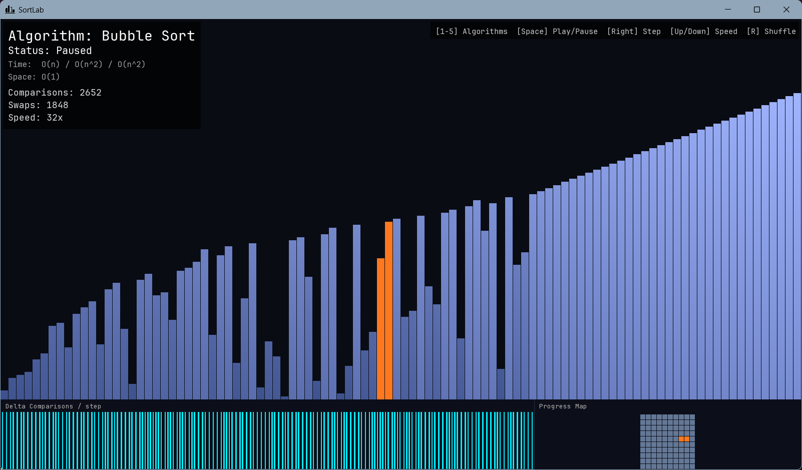

# 🎯 SortLab

### ⚡ Интерактивный визуализатор алгоритмов сортировки


---



---

## 📖 О проекте

**SortLab** — учебный инструмент для наглядного изучения алгоритмов сортировки.
Каждый элемент массива отображается как столбик. Высота = значение. Цвет = состояние.

Программа показывает работу алгоритма в реальном времени, шаг за шагом, с подсветкой
сравниваемых и переставляемых элементов, счётчиком операций и визуализацией прогресса.

---

## 🧮 Алгоритмы

| # | Алгоритм | Время (лучшее / среднее / худшее) | Память |
|---|---|---|---|
| `1` | 🫧 Bubble Sort | O(n) / O(n²) / O(n²) | O(1) |
| `2` | 🔍 Selection Sort | O(n²) / O(n²) / O(n²) | O(1) |
| `3` | 🃏 Insertion Sort | O(n) / O(n²) / O(n²) | O(1) |
| `4` | 🔀 Merge Sort | O(n log n) / O(n log n) / O(n log n) | O(n) |
| `5` | ⚡ Quick Sort | O(n log n) / O(n log n) / O(n²) | O(log n) |

---

## 🎮 Управление

| Клавиша | Действие |
|---|---|
| `Space` | ▶️ Старт / ⏸️ Пауза |
| `R` | 🔀 Перемешать массив |
| `→` | 👣 Один шаг (в режиме паузы) |
| `↑` / `↓` | 🐇 / 🐢 Увеличить / уменьшить скорость |
| `1` — `5` | 🔢 Выбрать алгоритм |
| `I` | ℹ️ Справка о программе |
| `Q` | 🚪 Выход |

---

## 🖥️ Интерфейс

```
┌──────────────────────────────────────────────────────────────┐
│ 📊 Algorithm: Quick Sort   Time: O(n log n)   Comparisons: 1.2k │  ← UI панель
├────────────────────────────────────┬─────────────────────────┤
│                                    │                         │
│         📈 Столбики массива        │   🗺️ Progress Map       │
│                                    │                         │
├────────────────────────────────────┴─────────────────────────┤
│  📉 Δ Comparisons / step  [гистограмма]                      │  ← нижняя панель
└──────────────────────────────────────────────────────────────┘
```

- 📊 **Главная область** — столбики с цветовой индикацией состояний
- 🗺️ **Progress Map** — миниатюрная сетка всего массива, зеленеет по мере сортировки
- 📉 **Δ Гистограмма** — количество сравнений на каждом шаге (пульс алгоритма)

### 🎨 Цветовая схема

| Цвет | Состояние |
|---|---|
| 🔵 Синий | Обычный элемент |
| 🩵 Голубой | Сравниваемые элементы |
| 🟠 Оранжевый | Переставляемые элементы |
| 🟢 Зелёный | Отсортированный элемент |

---

## 🔧 Сборка

### 📦 Зависимости
- 🛠️ [CMake](https://cmake.org/download/) ≥ 3.16
- 💻 [Visual Studio 2022](https://visualstudio.microsoft.com/) с компонентом **Desktop development with C++**
- 🌐 Git (для FetchContent — SFML скачивается автоматически)

### 🚀 Установка

```bash
git clone https://github.com/your-username/SortLab.git
cd SortLab
cmake -S . -B build
cmake --build build --config Release
.\build\Release\SortLab.exe
```

> 💡 SFML 2.6 скачивается и компилируется автоматически при первой сборке.
> ⏱️ Первый запуск `cmake -S . -B build` займёт 1–3 минуты.

### 🔤 Шрифт
Скачай [JetBrains Mono](https://www.jetbrains.com/lp/mono/) и положи файл в:
```
assets/fonts/JetBrainsMono-Regular.ttf
```

---

## 📁 Структура проекта

```
SortLab/
├── 🎨 assets/
│   ├── fonts/JetBrainsMono-Regular.ttf
│   ├── icon.ico
│   ├── icon.png
│   ├── preview.png
│   └── app.rc
├── 📋 include/
│   ├── App.hpp
│   ├── Array.hpp
│   ├── Sorter.hpp
│   ├── UI.hpp
│   ├── OperationsHistory.hpp
│   ├── ProgressMap.hpp
│   └── sorters/
│       ├── BubbleSorter.hpp
│       ├── SelectionSorter.hpp
│       ├── InsertionSorter.hpp
│       ├── MergeSorter.hpp
│       └── QuickSorter.hpp
├── 💻 src/
│   ├── main.cpp
│   ├── App.cpp
│   ├── App_audio.cpp
│   ├── Array.cpp
│   ├── Sorter.cpp
│   ├── UI.cpp
│   ├── OperationsHistory.cpp
│   ├── ProgressMap.cpp
│   └── sorters/
│       ├── BubbleSorter.cpp
│       ├── SelectionSorter.cpp
│       ├── InsertionSorter.cpp
│       ├── MergeSorter.cpp
│       └── QuickSorter.cpp
└── ⚙️ CMakeLists.txt
```

---

## 🏗️ Архитектура

```
main()
  └── App::run()
        ├── handleEvents()   — ввод с клавиатуры
        ├── update(dt)       — шаг сортировки + гистограмма
        └── render()
              ├── Array bars          — основная визуализация
              ├── UI overlay          — текст, статистика
              ├── ProgressMap         — мини-карта
              └── HistogramRenderer   — Δ гистограмма

Sorter (abstract)
  ├── BubbleSorter
  ├── SelectionSorter
  ├── InsertionSorter
  ├── MergeSorter
  └── QuickSorter
```

> 🔑 Ключевой паттерн: все алгоритмы реализованы как **конечные автоматы** (state machines).
> Метод `step()` выполняет ровно одну атомарную операцию и возвращает управление,
> не блокируя главный поток рендеринга.

---

## 📜 Лицензия

```
MIT License — 2026
```

---

<div align="center">
  <sub>🎓 made for college coursework &nbsp;|&nbsp; built with ❤️ and C++17</sub>
</div>
